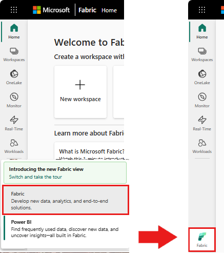

# Identifying and extracting tet with Document Intellignet microsoft Fabric

Azure AI services help developers and organizations rapidly create intelligent, cutting-edge, market-ready, and responsible applications with out-of-the-box and pre-built and customizable APIs and models. In this article, you'll use the various services available in Azure AI services to perform tasks that include: text analytics, translation, document intelligence, vision, image search, speech to text and text to speech conversion, anomaly detection, and data extraction from web APIs.

The goal of Azure AI services is to help developers create applications that can see, hear, speak, understand, and even begin to reason. The catalog of services within Azure AI services can be categorized into five main pillars: Vision, Speech, Language, Web search, and Decision.

## Prerequisites

- Get a Microsoft Fabric subscription. Or, sign up for a free Microsoft Fabric trial.

- Sign in to [Microsoft Fabric](https://fabric.microsoft.com/).

- Use the experience switcher on the bottom left side of your home page to switch to Fabric.

  

- Create a new notebook.
- Attach your notebook to a lakehouse. On the left side of your notebook, select Add to add an existing lakehouse or create a new one.
- Obtain an Azure AI services key by following [Quickstart: Create a multi-service resource for Azure AI services](https://learn.microsoft.com/en-us/azure/ai-services/multi-service-resource?pivots=azportal)
. Copy the value of the key to use in the code samples below.

## Prepare your system
To begin, import required libraries and initialize your Spark session.

```
from pyspark.sql.functions import udf, col
from synapse.ml.io.http import HTTPTransformer, http_udf
from requests import Request
from pyspark.sql.functions import lit
from pyspark.ml import PipelineModel
from pyspark.sql.functions import col
import os
```
```
from pyspark.sql import SparkSession
from synapse.ml.core.platform import *

# Bootstrap Spark Session
spark = SparkSession.builder.getOrCreate()
```

Import Azure AI services libraries and replace the keys and locations in the following code snippet with your Azure AI services key and location.

```
from synapse.ml.cognitive import *

# A general Azure AI services key for Text Analytics, Vision and Document Intelligence (or use separate keys that belong to each service)
service_key = "<YOUR-KEY-VALUE>" # Replace <YOUR-KEY-VALUE> with your Azure AI service key, check prerequisites for more details
service_loc = "eastus"

# A Bing Search v7 subscription key
bing_search_key =  "<YOUR-KEY-VALUE>" # Replace <YOUR-KEY-VALUE> with your Bing v7 subscription key, check prerequisites for more details

# An Anomaly Detector subscription key
anomaly_key = <"YOUR-KEY-VALUE"> # Replace <YOUR-KEY-VALUE> with your anomaly service key, check prerequisites for more details
anomaly_loc = "westus2"

# A Translator subscription key
translator_key = "<YOUR-KEY-VALUE>" # Replace <YOUR-KEY-VALUE> with your translator service key, check prerequisites for more details
translator_loc = "eastus"

# An Azure search key
search_key = "<YOUR-KEY-VALUE>" # Replace <YOUR-KEY-VALUE> with your search key, check prerequisites for more details
```

## Perform sentiment analysis on text
The Text Analytics service provides several algorithms for extracting intelligent insights from text. For example, you can use the service to find the sentiment of some input text. The service will return a score between 0.0 and 1.0, where low scores indicate negative sentiment and high scores indicate positive sentiment.

The following code sample returns the sentiment for three simple sentences.

```
# Create a dataframe that's tied to it's column names
df = spark.createDataFrame(
    [
        ("I am so happy today, its sunny!", "en-US"),
        ("I am frustrated by this rush hour traffic", "en-US"),
        ("The cognitive services on spark aint bad", "en-US"),
    ],
    ["text", "language"],
)

# Run the Text Analytics service with options
sentiment = (
    TextSentiment()
    .setTextCol("text")
    .setLocation(service_loc)
    .setSubscriptionKey(service_key)
    .setOutputCol("sentiment")
    .setErrorCol("error")
    .setLanguageCol("language")
)

# Show the results of your text query in a table format
display(
    sentiment.transform(df).select(
        "text", col("sentiment.document.sentiment").alias("sentiment")
    )
)
```
## Perform text analytics for health data
The Text Analytics for Health Service extracts and labels relevant medical information from unstructured text such as doctor's notes, discharge summaries, clinical documents, and electronic health records.

The following code sample analyzes and transforms text from doctors notes into structured data.

```
df = spark.createDataFrame(
    [
        ("20mg of ibuprofen twice a day",),
        ("1tsp of Tylenol every 4 hours",),
        ("6-drops of Vitamin B-12 every evening",),
    ],
    ["text"],
)

healthcare = (
    AnalyzeHealthText()
    .setSubscriptionKey(service_key)
    .setLocation(service_loc)
    .setLanguage("en")
    .setOutputCol("response")
)

display(healthcare.transform(df))
```


## Extract information from a document into structured data
Azure AI Document Intelligence is a part of Azure AI services that lets you build automated data processing software using machine learning technology. With Azure AI Document Intelligence, you can identify and extract text, key/value pairs, selection marks, tables, and structure from your documents. The service outputs structured data that includes the relationships in the original file, bounding boxes, confidence and more.

The following code sample analyzes a business card image and extracts its information into structured data.

```
from pyspark.sql.functions import col, explode

# Create a dataframe containing the source files
imageDf = spark.createDataFrame(
    [
        (
            "https://mmlspark.blob.core.windows.net/datasets/FormRecognizer/business_card.jpg",
        )
    ],
    [
        "source",
    ],
)

# Run the Form Recognizer service
analyzeBusinessCards = (
    AnalyzeBusinessCards()
    .setSubscriptionKey(service_key)
    .setLocation(service_loc)
    .setImageUrlCol("source")
    .setOutputCol("businessCards")
)

# Show the results of recognition.
display(
    analyzeBusinessCards.transform(imageDf)
    .withColumn(
        "documents", explode(col("businessCards.analyzeResult.documentResults.fields"))
    )
    .select("source", "documents")
)
```


## Search for images that are related to a natural language query
Bing Image Search searches the web to retrieve images related to a user's natural language query.

The following code sample uses a text query that looks for images with quotes. The output of the code is a list of image URLs that contain photos related to the query.

```
# Number of images Bing will return per query
imgsPerBatch = 10
# A list of offsets, used to page into the search results
offsets = [(i * imgsPerBatch,) for i in range(100)]
# Since web content is our data, we create a dataframe with options on that data: offsets
bingParameters = spark.createDataFrame(offsets, ["offset"])

# Run the Bing Image Search service with our text query
bingSearch = (
    BingImageSearch()
    .setSubscriptionKey(bing_search_key)
    .setOffsetCol("offset")
    .setQuery("Martin Luther King Jr. quotes")
    .setCount(imgsPerBatch)
    .setOutputCol("images")
)

# Transformer that extracts and flattens the richly structured output of Bing Image Search into a simple URL column
getUrls = BingImageSearch.getUrlTransformer("images", "url")

# This displays the full results returned, uncomment to use
# display(bingSearch.transform(bingParameters))

# Since we have two services, they are put into a pipeline
pipeline = PipelineModel(stages=[bingSearch, getUrls])

# Show the results of your search: image URLs
display(pipeline.transform(bingParameters))
```
## Get information from arbitrary web APIs
With HTTP on Spark, you can use any web service in your big data pipeline. The following code sample uses the World Bank API to get information about various countries around the world.

```
# Use any requests from the python requests library


def world_bank_request(country):
    return Request(
        "GET", "http://api.worldbank.org/v2/country/{}?format=json".format(country)
    )

# Create a dataframe with specifies which countries we want data on
df = spark.createDataFrame([("br",), ("usa",)], ["country"]).withColumn(
    "request", http_udf(world_bank_request)(col("country"))
)

# Much faster for big data because of the concurrency :)
client = (
    HTTPTransformer().setConcurrency(3).setInputCol("request").setOutputCol("response")
)

# Get the body of the response


def get_response_body(resp):
    return resp.entity.content.decode()


# Show the details of the country data returned
display(
    client.transform(df).select(
        "country", udf(get_response_body)(col("response")).alias("response")
    )
)
```